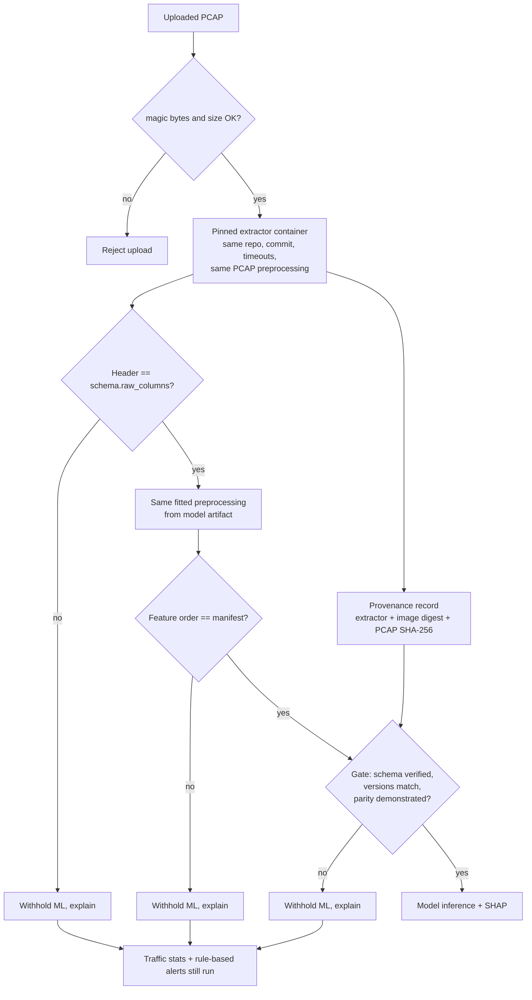

# ML Data Contract

The rules that every byte of data must satisfy before a model trains on it or predicts on it.
The contract is **machine-readable** (YAML schemas + experiment configs) and **enforced in code**
(`ml/src/cybersentinel_ml/contract/`). Training and inference both consume the same schema.

## 1. Artifacts that make up the contract

| Artifact | Path | Owner of |
|---|---|---|
| Feature schema, Track A | `ml/config/schemas/track_a_cicids2017.yaml` | Raw header, feature definitions, extractor, preprocessing version, vocabulary |
| Feature schema, Track B | `ml/config/schemas/track_b_darknet2020.yaml` | Same, for Track B |
| Experiment configs | `ml/config/experiments/*.yaml` | Task, label map, display text, split, seed, models, calibration, threshold, ablations |
| Dataset registry | `ml/config/datasets.yaml` | Sources, citations, terms, file checksums |
| Preprocessing manifest | written next to each model (Phase 5) | Fitted state: final feature order + hash, dropped constant features, preprocessing version, schema hash |
| Model manifest | written next to each model (Phase 5) | Model id/version, schema id/version/hash, experiment hash, dataset hashes, classes, seed, library versions, artifact hash |
| Input provenance | attached to every batch at ingestion | Source type (csv/pcap), extractor identity and settings, whether the platform verified it |

Human-readable renderings of the schemas (generated, do not edit): [schemas/track_a_cicids2017.md](schemas/track_a_cicids2017.md), [schemas/track_b_darknet2020.md](schemas/track_b_darknet2020.md).

## 2. What the schema documents for every feature

Each entry in `features` (model inputs) and `excluded_features` has:

| Field | Meaning |
|---|---|
| `name` | Canonical snake_case name used in code. Shared names across tracks do **not** imply shared definitions (ADR 0005) |
| `source_column` | Exact column name in the extractor's CSV header |
| `dtype` | `float64` or `int64` after validation |
| `unit` | microseconds, bytes, packets, count, ratio, bytes per second, ... |
| `group` | time, volume, packet_size, rate, tcp_flags, bulk, subflow, tcp_window, activity, ... |
| `meaning` | What the value measures, in words |
| `source` | Which extractor produced it |
| `expected_range` | Valid min/max. Outside the range the value becomes NaN and is counted in the data report |
| `missing_values` | How NaN/Infinity is handled |
| `scaling` | Per model family (LR vs tree models) |
| `encoding` | numeric, one-hot with fixed categories, or numeric for tree models only |
| `pcap_available` | `pinned_extractor_only` (Track A), `unverified` (Track B), or `no` |
| `included` | Model input or not. Excluded entries must say why in `notes` |
| `status` | `draft` until checked against the real data, then `verified` |
| `notes` | Caveats, bugs, label coupling, [VERIFY] items |

Identifier columns (Flow ID, IPs, source port, timestamp) are declared separately with the reason they are **never** model inputs. They are still kept for display, alert rules, related-flow lookup and timelines.

## 3. Preprocessing policy (version 0.1.0, both tracks)

Applied in this order. Everything that is "fitted" is fitted on the **training split only** and stored in the preprocessing manifest.

1. **Header check.** Raw CSV header must equal `raw_columns` exactly (names and order). No silent renaming or whitespace stripping; an adapter must do that explicitly if a dataset needs it.
2. **Label mapping.** Raw labels map to classes through the experiment's `label_map`. An unknown label **fails the run** (`unknown_label_policy: fail`).
3. **Type validation.** Numeric columns that contain non-numeric strings fail validation. Rows are not silently coerced.
4. **Infinity to NaN.** CICFlowMeter writes Infinity/NaN for rate features when duration is 0.
5. **Out-of-range to NaN**, counted per class in the data report.
6. **Derived feature** `zero_duration_flag = 1.0 if flow_duration == 0 else 0.0`, so the "undefined rate" information survives imputation.
7. **Duplicates.** Exact duplicate rows (features + label) are dropped before splitting. Rows with identical features but different labels are dropped and reported as label conflicts.
8. **Split.** Stratified random 70/15/15 with seed 42.
9. **Constant features** on the training split are dropped. The list is stored so inference drops the same ones.
10. **Imputation.** NaN replaced by the training-split median per feature.
11. **Encoding.** `protocol`: one-hot over fixed categories (6, 17) plus "other". `dst_port`: numeric for tree models, excluded from Logistic Regression (a port number is not a linear quantity).
12. **Scaling.** Logistic Regression: `signed_log1p` then StandardScaler. Tree models: none.
13. **Order.** Final order = schema feature order, minus dropped constants, plus derived features. Stored with its SHA-256. Checked at inference.

Any change to these rules bumps `preprocessing.version`, which invalidates every model trained with the old version (the gate refuses to mix them).

## 4. Validation that runs automatically

| Check | Where | Blocks |
|---|---|---|
| Schema internally consistent: every raw column has exactly one role; no duplicate names; excluded features have a reason; a verified schema has a pinned commit | `FeatureSchema` validator, on every load | Loading |
| Unknown YAML keys | `extra="forbid"` on every model | Loading |
| Identifiers and labels are never model inputs | `tests/test_schema_files.py` | CI |
| Track B display text uses no harm vocabulary | schema `forbidden_terms` + `load_experiment` + tests | Loading, CI |
| Raw header: duplicates, missing, unexpected, order (with whitespace hint) | `check_raw_header`, `cybersentinel-ml check-header` | Ingestion |
| Feature frame: missing, unexpected, order, numeric dtypes | `check_feature_frame` | Inference |
| Schema id/version/hash match the model | inference gate | Inference |
| Preprocessing version matches | inference gate | Inference |
| Extractor name/repository/commit/timeouts match training data | inference gate | Inference |
| Extractor commit pinned | inference gate | Inference |
| PCAP parity demonstrated; PCAP flows produced by the platform's extractor | inference gate | PCAP inference |
| Feature order hash matches order in manifest | `PreprocessingManifest` validator | Loading a model |

## 5. PCAP path (target design)

Current state: Track A parity is `not_demonstrated`, Track B parity cannot be demonstrated. Both PCAP paths are therefore withheld.

## 6. How a schema goes from draft to verified

1. Download the dataset. Record SHA-256 in `ml/config/datasets.yaml`.
2. `cybersentinel-ml check-header` passes (or the schema is corrected to match reality, with the change reviewed).
3. `cybersentinel-ml inspect-labels --experiment ...` shows no unmapped labels.
4. Phase 4 EDA diagnostics resolve the feature-level [VERIFY] notes (sentinel values, flag semantics, timestamp-like values).
5. Extractor commit is pinned (Track A).
6. Set feature `status: verified`, schema `status: verified`, bump `schema_version`, regenerate docs, commit.

Parity is a separate, later step (ADR 0006). A verified schema allows CSV training and CSV inference. PCAP inference also needs `parity.status: demonstrated`.
