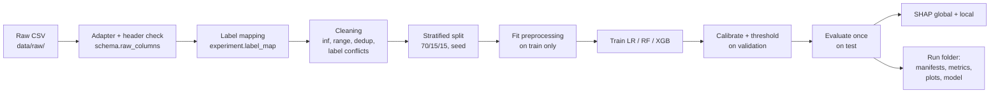

# ML Pipeline Design

Data -> preprocessing -> feature schema -> training -> evaluation -> XAI, for both tracks.
Status per stage is shown so it is always clear what exists and what is planned.

## 1. Stages



| Stage | Phase | Status |
|---|---|---|
| Schema, experiment configs, contract validation, header/label inspection | 1 | **Done** |
| Adapters, cleaning, data report, splits, preprocessing fit/transform | 4 | Planned |
| Baseline training, calibration, thresholds, evaluation, leakage checks | 5 | Planned |
| Optional MLP comparison | 6 | Optional (ADR 0008) |
| SHAP global and local explanations, analyst text | 7 | Planned |

## 2. Commands

Working now:

```bash
cd ml
.venv/bin/cybersentinel-ml validate-config
.venv/bin/cybersentinel-ml check-header --schema config/schemas/<schema>.yaml --csv <file>
.venv/bin/cybersentinel-ml inspect-labels --csv <file> --column Label --experiment config/experiments/<exp>.yaml
.venv/bin/pytest
```

Planned (the interface is fixed now so configs and docs do not change later):

```bash
cybersentinel-ml prepare  --experiment config/experiments/track_a_binary.yaml    # writes data/processed/<dataset>/<split>.parquet + data report
cybersentinel-ml train    --experiment config/experiments/track_a_binary.yaml    # writes runs/<run_id>/
cybersentinel-ml evaluate --run runs/<run_id>                                    # metrics.json, plots, model card
cybersentinel-ml explain  --run runs/<run_id>                                    # global SHAP + sample local explanations
```

## 3. Data report (Phase 4, per dataset file)

Written before any model is trained, committed as JSON + Markdown (aggregates only, no rows):

- File SHA-256, row count, column count, header check result
- Class distribution (raw labels and mapped classes), with imbalance ratio
- Per feature: NaN count, Infinity count, out-of-range count (each broken down by class), min/max/percentiles
- Exact duplicate count, conflicting-label duplicate count
- Constant and near-constant features
- Track B diagnostics: do Active/Idle values look like timestamps? Are PSH/URG flag columns near-constant?
- Track A diagnostics: distribution of `fwd_payload_bytes_total == 0` by class (Attempted coupling)

## 4. Splits

- **Primary:** stratified random 70/15/15, seed 42, after exact de-duplication. Comparable with most published work.
- **Test set used once.** Model selection, calibration and thresholds use validation only.
- **Leakage guard:** after splitting, assert zero identical feature rows between train and test.
- **Secondary (Track A, planned):** temporal holdout. Train on some capture days, test on a held-out day. Expect worse numbers. That gap is the honest estimate of generalization and goes in the README.

Known limitation: a random split puts flows from the same attack session in both train and test. Near-duplicate flows make scores optimistic even after exact de-duplication. The temporal holdout exists to show how optimistic.

## 5. Models (identical data, splits and seed)

| Model | Why it is in the comparison | Preprocessing |
|---|---|---|
| Logistic Regression | Simple linear baseline. If it scores almost as well as the trees, the task is easy or leaky | signed_log1p + StandardScaler, class_weight balanced, no dst_port |
| Random Forest | Strong non-linear baseline, few hyperparameters | none, class_weight balanced_subsample |
| XGBoost | Usually the strongest on tabular data; fast exact SHAP | none, sample weights for imbalance, early stopping on validation |
| Always-majority dummy | Shows what accuracy alone would reward | none |

Starting hyperparameters are in the experiment configs. Tuning, if any, uses validation only and is recorded in the run folder.

## 6. Evaluation (per model, per task)

- Precision, recall, F1 per class; macro and weighted averages
- Confusion matrix, counts and row-normalized
- ROC-AUC: binary; one-vs-rest macro for multi-class
- PR-AUC (average precision): primary metric for binary, because it reflects performance on the rare positive class
- At the chosen threshold: false-positive rate as "false alerts per 10,000 benign flows"
- Calibration: Brier score and reliability diagram (confidence is shown to analysts, so it must mean something)
- Inference time: p50/p95 per single flow and throughput for a 10k batch, CPU model recorded
- Model size on disk, training time
- Accuracy is reported last, next to the majority-class baseline, to show why it misleads on imbalanced data

## 7. Leakage and "too good to be true" checks

| Check | What it catches | Action if triggered |
|---|---|---|
| Identifiers/labels not in inputs (test) | Direct leakage | Build fails |
| Train/test duplicate rows = 0 | Split leakage | Run fails |
| **Shuffled-label control:** train on permuted labels | Pipeline bugs that leak labels | Must score near chance; otherwise run is flagged invalid |
| **Single-feature AUC:** each feature alone | One feature that encodes the label (for example the Attempted coupling) | Listed in the report; investigated before claiming results |
| **No-port ablation** | Port-number shortcut learning | Report the drop in performance |
| Train vs test gap | Overfitting | Reported |
| Track B 4-class diagnostic | Capture-session artifact (Non-Tor vs Non-VPN) | Reported as dataset limitation |
| Temporal holdout (Track A) | Optimistic random split | Reported next to primary results |

Near-perfect scores are treated as a question, not a result.

## 8. Reproducibility

Each run folder `runs/<run_id>/` (gitignored; published via GitHub Releases) contains:

- `model_manifest.json` (see `ModelManifest` in `contract/manifest.py`): model id and version, track, task, algorithm, schema id/version/SHA-256, experiment config SHA-256, preprocessing manifest, dataset file SHA-256s, classes, seed, git commit, library versions, artifact SHA-256
- `preprocessing_manifest.json`: preprocessing version, final feature order and its SHA-256, dropped constant features, fitted medians and scaler parameters
- `metrics.json`, plots, `model_card.md`
- the model artifact (XGBoost JSON; scikit-learn models via skops or joblib, loaded only after the SHA-256 check)

Seeds: one `seed` per experiment feeds NumPy, scikit-learn `random_state`, and XGBoost `seed`. Dependency versions are locked (`uv.lock`, created in Phase 4 when training dependencies are added).

Metrics JSON and plots for published results are copied into `ml/results/` and committed, so numbers in the README can be traced to a run.

## 9. XAI (Phase 7)

- Tree models: SHAP TreeExplainer. Logistic Regression: coefficients and SHAP LinearExplainer.
- Global importance: mean |SHAP| over a fixed, seeded sample of the test split, stored with the run.
- Local explanation per flow: top positive and negative contributors with actual feature values, rendered in analyst language from the schema's `meaning` and `unit` fields (no LLM).
- Stated limits: SHAP explains the model's raw score (before calibration), not the attacker; correlated features share credit unpredictably; a plausible explanation does not make a prediction correct.
- The gate applies to explanations too. No prediction, no explanation.
