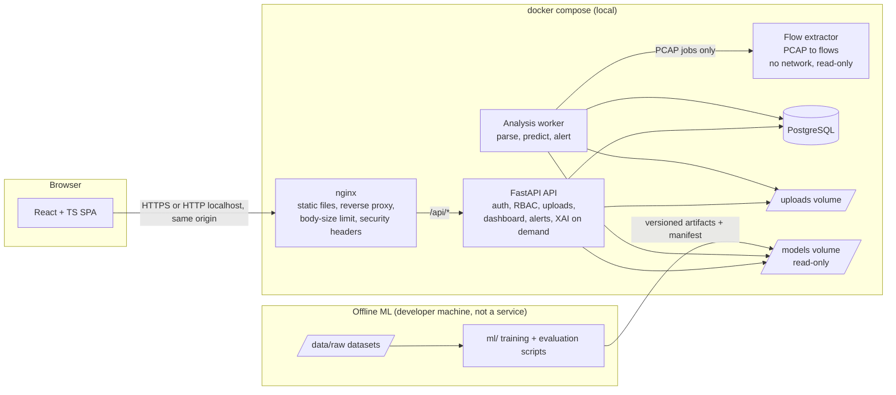
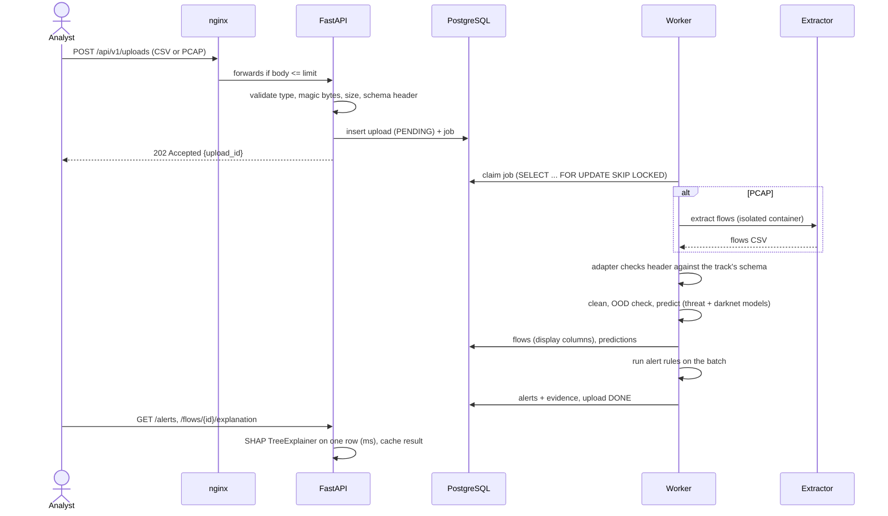
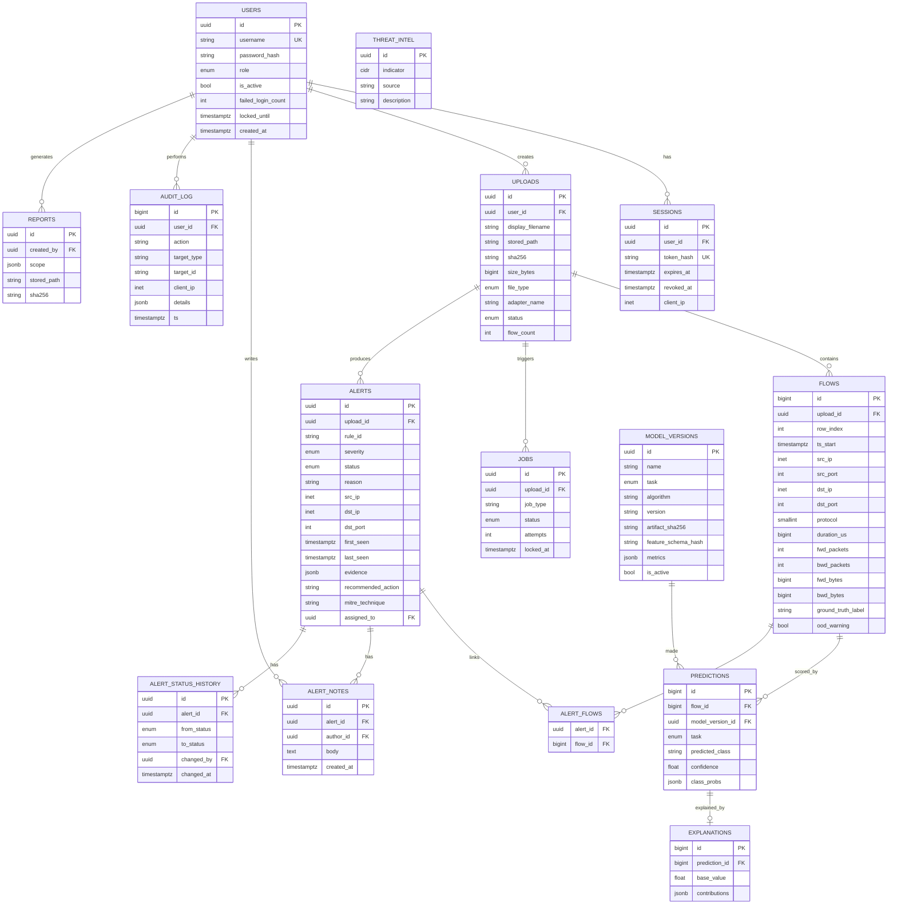
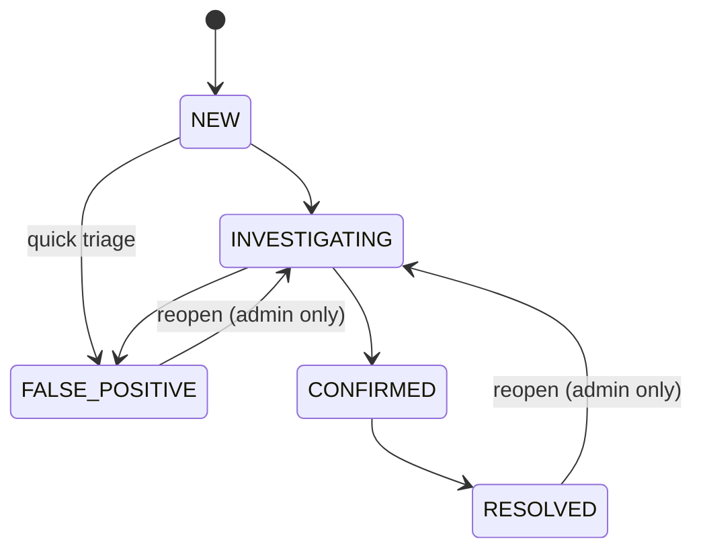
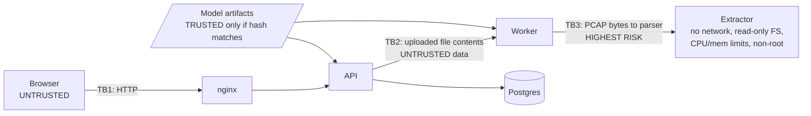

# CyberSentinel: Project Plan and Architecture

**Explainable Network Threat Detection and SOC Analysis Platform**

Status: Phase 1, v0.2 (September 2026)
Author: Ebey

> Items tagged **[VERIFY]** are not confirmed yet. The full list, with how to check each one, is in [VERIFY.md](VERIFY.md).

## Revision log

| Version | Date | Change |
|---|---|---|
| 0.1 | 2026-09-23 | First architecture and roadmap |
| 0.2 | 2026-09-24 | Critical review (below). Two analytical tracks with **separate** feature schemas. ML-first build order adopted. ML data contract added ([ML_DATA_CONTRACT.md](ML_DATA_CONTRACT.md)) |

## Critical review of v0.1

Assumptions in v0.1 that were checked, and what changed:

| # | v0.1 assumption | Finding | Change in v0.2 |
|---|---|---|---|
| 1 | Both datasets use CICFlowMeter, so **one canonical schema** covers both | **Wrong.** Upstream CICFlowMeter emits 84 columns, the Engelen fork 94. The fork also changes TCP flow termination (FIN both ways, RST ends flow), fixes Active/Idle features that encoded an absolute timestamp, and fixes PSH/URG flag counts. Same column names, different definitions | One schema per track ([ADR 0005](adr/0005-separate-feature-schema-per-track.md)). Track B excludes the bug-affected features |
| 2 | CIC-Darknet2020 4-class traffic type is a good task | Non-Tor and Non-VPN come from different capture sessions. Separating them likely learns the capture environment | Primary Track B task is 3-class (TOR, VPN, REGULAR); 4-class kept as a diagnostic ([ADR 0002](adr/0002-darknet2020-is-not-attack-data.md)) |
| 3 | Darknet model is "only validated on its own distribution" | Stronger than that: the extractor version and timeouts CIC used are unknown, so PCAP parity is impossible for now | Track B is CSV-only. PCAP inference withheld ([ADR 0006](adr/0006-pcap-feature-parity-is-mandatory.md), [ADR 0007](adr/0007-withhold-predictions-without-parity.md)) |
| 4 | "Attempted" flows relabelled BENIGN [VERIFY] | Confirmed in Engelen's code. Also found: Attempted is defined as TCP + `Total Length of Fwd Packet == 0`, so the label is partly a function of one feature | Documented as label-feature coupling; single-feature AUC check added ([ADR 0004](adr/0004-prefer-corrected-cicids2017.md)) |
| 5 | Building the fixed CICFlowMeter may be painful | The fork ships a Dockerfile and documented Docker usage | Lower risk. Build still to be confirmed (V22) |
| 6 | Extractor settings not mentioned | Engelen used flow timeout 120,000,000 us and activity timeout 5,000,000 us; the CNS 2022 pipeline also ran pcapfix and reordercap | Timeouts and PCAP preprocessing are part of the extractor contract and checked by the inference gate |
| 7 | Corrected CSVs can be downloaded | Not confirmed. The authors' site was unreachable from the research environment. Their READMEs describe regenerating from raw PCAPs | Two acquisition options in `ml/config/datasets.yaml` (V1) |
| 8 | Dataset sizes and class counts quoted from papers | One Darknet2020 paper gives two different totals | No counts hardcoded anywhere. Computed from data (V7) |
| 9 | Published high scores on Darknet2020 are a fair benchmark | At least one paper uses IP-address octets as features, which is a shortcut in lab data | IPs excluded; results not compared with IP-based papers |
| 10 | Labels can be taken as given | Labels were assigned from attacker IPs and time windows | IPs and timestamps excluded from model inputs. Temporal holdout experiment planned |

Still unverified and listed in VERIFY.md: exact dataset releases and headers, label strings, extractor commit, several feature definitions, dataset terms.

---

## 0. Decisions already made

| Decision | Choice | Why |
|---|---|---|
| Track A dataset | **Corrected CIC-IDS2017** (Engelen et al.) | Has real attack labels. The original release has documented labelling and flow-extraction errors, and the corrected version fixes them. |
| Track B dataset | **CIC-Darknet2020**, separate Tor/VPN characterization track | It has **no attack labels** (Tor / Non-Tor / VPN / Non-VPN + 8 application types). Output is a policy/risk signal, never "malicious". |
| Feature schemas | **One per track** | The two datasets were made with different CICFlowMeter versions whose features differ in number and definition (ADR 0005). |
| Build order | ML first: Phases 1, 4, 5, 7, then the web app | The data/model pipeline is the biggest risk (ADR 0009). |
| Deployment | Local only, `docker compose up` | Smaller attack surface, no hosting cost, still fully demoable. |
| Frontend | React + TypeScript | TypeScript is what most job posts expect. |
| Compute | CPU only | Tree models train fine on CPU. Any deep-learning model stays small. |
| Time budget | ~5-8 h/week | Drives the scope cuts and the ML-first build order in Section 8. |

---

## 1. Project architecture

### 1.1 System overview



### 1.2 How a single upload flows through the system



### 1.3 Key architectural ideas (the parts to explain in an interview)

1. **Offline training, online inference.** Training is a reproducible script run, not a web feature. The web app only loads versioned, hash-verified model artifacts. No one can upload a model (pickle files execute code on load).
2. **One feature schema per track + dataset adapters.** Each track has its own machine-readable schema pinned to the extractor that made its training data. Same column name does not mean same definition across CICFlowMeter versions (ADR 0005). Adding a dataset means adding a schema and an adapter, not touching the app.
3. **Train/serve parity is tested, not assumed.** The model only means something if uploaded traffic produces the same features as the training data. PCAP scoring is only enabled once a parity test passes (Section 5.6).
4. **Two independent detection sources.** ML predictions and transparent rule-based detections (port scan, connection bursts, intel match). Rules catch patterns across many flows, which a per-flow classifier cannot see.
5. **Explanations describe the model, not the attack.** SHAP says which features pushed the score. It does not prove causality. The UI says this plainly.

---

## 2. Recommended technology stack

| Layer | Choice | Reason / alternative considered |
|---|---|---|
| Language (backend + ML) | Python 3.12 | Best library support for SHAP, XGBoost, scikit-learn. 3.13 probably works too **[VERIFY wheels at setup time]**. |
| Package manager | **uv** (Astral) with `uv.lock` | Fast, lockfile-based, reproducible. Alternative: pip-tools. |
| API framework | FastAPI + Pydantic v2 | Typed request validation, automatic OpenAPI docs. |
| ORM + migrations | SQLAlchemy 2.0 + Alembic | Parameterized queries by default (SQL injection protection), versioned schema changes. |
| Database | **PostgreSQL 16** in Docker, even in development | SQLite behaves differently (types, JSON, locking). With Docker already chosen, running Postgres locally costs nothing and avoids "works on SQLite, breaks on Postgres" bugs. |
| Job queue | Postgres `jobs` table + worker using `FOR UPDATE SKIP LOCKED` | No Redis/Celery to run and secure. About 60 lines. Alternative if needed later: RQ + Redis. |
| Feature storage per upload | Parquet file per upload | Keeps ~80 floats per flow out of Postgres. DB stores only display columns. |
| ML | scikit-learn (LR, RF), XGBoost (hist) | Standard, fast on CPU, well supported by SHAP. |
| Deep learning (optional) | PyTorch, small MLP, CPU | Only as a documented comparison (see 5.5). |
| XAI | SHAP (TreeExplainer, LinearExplainer) | Exact and fast for tree models. |
| Model persistence | XGBoost native JSON; scikit-learn via **skops** or joblib + SHA-256 check | skops is a library for safer scikit-learn persistence than raw pickle. Either way, load only from the trusted artifacts folder. |
| Flow extraction (PCAP) | Engelen's modified CICFlowMeter (Java), pinned commit, in its own container | Matches the corrected CIC-IDS2017 features. The fork ships a Dockerfile; build to be confirmed (VERIFY V22). A Python re-implementation is only acceptable if it passes the same parity test (ADR 0006). |
| Frontend | React 18/19 + TypeScript + Vite | |
| Data fetching | TanStack Query | Caching, loading and error states handled by the library. |
| Charts | Recharts | Simple React API, enough for SOC dashboards. |
| Styling | Tailwind CSS | Fast to build a clean dashboard without a big component library. |
| API types in frontend | **openapi-typescript** (generates TS types from FastAPI's OpenAPI) | Frontend and backend types cannot drift apart. |
| Reports | Jinja2 (autoescape on) to HTML, WeasyPrint to PDF | Template-based, no LLM, so every sentence is traceable to data. |
| Logging | structlog (JSON logs) with request IDs | |
| Testing | pytest, pytest-cov, httpx TestClient; Vitest + React Testing Library; Playwright for a few end-to-end flows | |
| Lint/format | ruff (includes bandit-style security rules), mypy (backend), ESLint + Prettier (frontend) | |
| Security tooling | pre-commit + gitleaks, pip-audit, npm audit, Dependabot, CodeQL, Trivy (container scan) | All free for public repos. |
| Containers | Docker + Docker Compose | |
| CI | GitHub Actions | |

**Deviations from the initially suggested stack, and why:**

- **SQLite dropped in favor of Postgres from day one.** Docker makes it free, and it avoids a migration later.
- **Scapy/PyShark are not used for ML features.** They are fine for packet parsing, but the model was trained on CICFlowMeter features. Computing "similar" features with Scapy would silently break predictions. Scapy may still be used for PCAP sanity checks (magic bytes, packet count) before extraction.
- **No Celery/Redis.** Not needed at this scale, and every extra service is more to secure and explain.

---

## 3. Complete folder structure

Status as of Phase 1. Paths with no status marker are committed now. Paths marked **(planned)** do not exist yet. Folders marked **(placeholder)** only contain a README for now.

```
cybersentinel/
├── .github/
│   ├── workflows/                  # (planned) CI is added in a later phase
│   │   ├── ci.yml                  # lint, type-check, tests (backend, ml, frontend)
│   │   └── security.yml            # CodeQL, pip-audit, npm audit, gitleaks, Trivy
│   ├── dependabot.yml
│   ├── ISSUE_TEMPLATE/
│   │   ├── bug_report.md
│   │   └── feature_request.md
│   └── pull_request_template.md
│
├── backend/                        # (placeholder) Phases 2-3
│   ├── README.md
│   ├── pyproject.toml              # (planned)
│   ├── uv.lock                     # (planned)
│   ├── alembic.ini                 # (planned)
│   ├── alembic/                    # (planned)
│   │   ├── env.py
│   │   └── versions/
│   ├── app/                        # (planned)
│   │   ├── main.py                 # app factory, middleware, routers
│   │   ├── core/
│   │   │   ├── config.py           # pydantic-settings, reads env vars only
│   │   │   ├── security.py         # Argon2id hashing, session tokens, CSRF
│   │   │   ├── logging.py          # structlog JSON, request IDs, redaction
│   │   │   ├── errors.py           # RFC 9457 problem+json handlers
│   │   │   └── rate_limit.py
│   │   ├── db/
│   │   │   ├── base.py
│   │   │   └── session.py
│   │   ├── models/                 # SQLAlchemy ORM models (one file per table group)
│   │   ├── schemas/                # Pydantic request/response models
│   │   ├── api/
│   │   │   ├── deps.py             # get_db, get_current_user, require_role
│   │   │   └── v1/
│   │   │       ├── auth.py
│   │   │       ├── users.py
│   │   │       ├── uploads.py
│   │   │       ├── flows.py
│   │   │       ├── models.py
│   │   │       ├── dashboard.py
│   │   │       ├── alerts.py
│   │   │       ├── reports.py
│   │   │       └── health.py
│   │   ├── services/
│   │   │   ├── file_validation.py
│   │   │   ├── upload_service.py
│   │   │   ├── analysis_service.py
│   │   │   ├── explanation_service.py   # SHAP + analyst-language templates
│   │   │   ├── dashboard_service.py
│   │   │   ├── report_service.py
│   │   │   ├── audit_service.py
│   │   │   └── alert_engine/
│   │   │       ├── engine.py
│   │   │       ├── rules/              # one module per rule
│   │   │       └── rules.yaml          # thresholds, severities, actions
│   │   ├── worker/
│   │   │   ├── runner.py           # job loop
│   │   │   └── jobs.py
│   │   └── templates/reports/
│   │       └── report.html.j2
│   └── tests/                      # (planned)
│       ├── conftest.py
│       ├── unit/
│       └── integration/
│
├── ml/
│   ├── pyproject.toml              # installable package: cybersentinel-ml (src layout)
│   ├── README.md
│   ├── config/
│   │   ├── schemas/                # ONE feature schema per track (ADR 0005)
│   │   │   ├── track_a_cicids2017.yaml
│   │   │   └── track_b_darknet2020.yaml
│   │   ├── experiments/            # task, label map, display text, split, seed, models
│   │   │   ├── track_a_binary.yaml
│   │   │   ├── track_a_multiclass_family.yaml
│   │   │   ├── track_b_traffic_type.yaml
│   │   │   ├── track_b_traffic_type_4class_diagnostic.yaml
│   │   │   └── track_b_application_category.yaml
│   │   └── datasets.yaml           # sources, citations, terms, checksums
│   ├── src/cybersentinel_ml/
│   │   ├── __init__.py
│   │   ├── cli.py                  # Phase 1: validate-config, check-header, inspect-labels, schema-docs
│   │   ├── contract/               # Phase 1: schema, manifests, validation, inference gate
│   │   │   ├── __init__.py
│   │   │   ├── experiment.py
│   │   │   ├── gate.py
│   │   │   ├── manifest.py
│   │   │   ├── schema.py
│   │   │   └── validation.py
│   │   ├── datasets/               # (planned) Phase 4: one adapter per dataset
│   │   ├── preprocessing/          # (planned) Phase 4: cleaning, splits, fitted preprocessing
│   │   ├── training/               # (planned) Phase 5
│   │   ├── evaluation/             # (planned) Phase 5: metrics, plots, latency, leakage checks
│   │   ├── explain/                # (planned) Phase 7: SHAP + analyst text
│   │   ├── inference/              # (planned) Phase 5/8: artifact store (hash check), predictor, OOD warning
│   │   └── extraction/             # (planned) Phase 4b: pinned extractor wrapper, parity test
│   ├── results/                    # (placeholder) committed: metrics JSON + plots + parity evidence
│   │   └── README.md
│   ├── notebooks/                  # (planned) EDA only, never part of the pipeline
│   └── tests/                      # contract tests on synthetic data
│       ├── __init__.py
│       ├── conftest.py
│       ├── test_cli.py
│       ├── test_experiments.py
│       ├── test_gate.py
│       ├── test_manifest.py
│       ├── test_schema_files.py
│       └── test_validation.py
│
├── models/                         # gitignored binaries; only README + model cards committed
│   └── README.md
│
├── data/
│   ├── README.md                   # download steps, checksums, licenses, citations
│   ├── raw/                        # gitignored (.gitkeep only)
│   ├── interim/                    # gitignored (.gitkeep only)
│   ├── processed/                  # gitignored (.gitkeep only)
│   ├── fixtures/                   # small SYNTHETIC files for tests (no real dataset rows)
│   │   └── README.md
│   └── threat_intel/               # (planned)
│       └── sample_blocklist.csv
│
├── frontend/                       # (placeholder) Phases 9-10
│   ├── README.md
│   ├── package.json                # (planned)
│   ├── package-lock.json           # (planned)
│   ├── vite.config.ts              # (planned)
│   ├── tsconfig.json               # (planned)
│   └── src/                        # (planned)
│       ├── main.tsx
│       ├── App.tsx
│       ├── api/                    # generated types + fetch client
│       ├── auth/
│       ├── pages/                  # Login, Dashboard, Uploads, Flows, Alerts,
│       │                           # Investigation, Reports, Models
│       ├── components/
│       │   ├── charts/
│       │   ├── tables/
│       │   └── xai/                # SHAP waterfall/bar components
│       ├── hooks/
│       └── lib/
│
├── docker/                         # (placeholder) Phases 4b and 13
│   ├── README.md
│   ├── backend.Dockerfile          # (planned) used by api and worker (different command)
│   ├── frontend.Dockerfile         # (planned) multi-stage: build, then nginx
│   ├── extractor.Dockerfile        # (planned)
│   └── nginx/nginx.conf            # (planned)
│
├── scripts/                        # (placeholder)
│   ├── README.md
│   ├── download_datasets.md        # (planned) manual steps (CIC requires a form) + checksum verify
│   ├── verify_checksums.py         # (planned)
│   ├── create_admin.py             # (planned) reads password from prompt, never from argv
│   └── generate_api_types.sh       # (planned)
│
├── tests/
│   └── e2e/                        # (placeholder) Playwright, runs against docker compose
│       └── README.md
│
├── docs/
│   ├── README.md                   # index of docs and their status
│   ├── PROJECT_PLAN.md             # this file
│   ├── DATASETS.md                 # dataset matrix (Phase 1)
│   ├── ML_DATA_CONTRACT.md         # Phase 1
│   ├── ML_PIPELINE.md              # Phase 1 design, filled in Phases 4-7
│   ├── VERIFY.md                   # open verification items
│   ├── schemas/                    # generated from the schema YAMLs
│   │   ├── track_a_cicids2017.md
│   │   └── track_b_darknet2020.md
│   ├── adr/                        # Architecture Decision Records 0001-0009 (more later) + README index
│   ├── ARCHITECTURE.md             # (planned) later phases
│   ├── XAI.md                      # (planned) Phase 7
│   ├── API.md                      # (planned) Phase 2+
│   ├── DATABASE.md                 # (planned) Phase 3
│   ├── SECURITY_ARCHITECTURE.md    # (planned) Phase 3/12
│   ├── THREAT_MODEL.md             # (planned) Phase 12, STRIDE
│   ├── TESTING.md                  # (planned) Phase 12
│   └── screenshots/                # (planned)
│
├── docker-compose.yml              # (planned)
├── docker-compose.dev.yml          # (planned)
├── Makefile                        # make setup, make lint, make test, make validate (make help lists all)
├── .pre-commit-config.yaml
├── .editorconfig
├── .env.example
├── .gitignore
├── README.md
├── CONTRIBUTING.md
├── SECURITY.md
├── CHANGELOG.md
└── LICENSE                         # MIT
```

**Note on `/tests`:** unit and integration tests live next to each package (`backend/tests`, `ml/tests`, frontend `*.test.tsx`), which keeps pytest config simple. The top-level `/tests` holds only cross-service end-to-end tests.

**Note on data in git:** CIC datasets have their own terms of use **[VERIFY redistribution terms on the UNB CIC site]**. Do not commit raw rows. Test fixtures are small synthetic files that follow the CICFlowMeter column format.

---

## 4. Database design

### 4.1 Entity relationship diagram



### 4.2 Design notes

- **Full feature vectors are not in Postgres.** They live in `data/uploads/{upload_id}.parquet`, and `flows.row_index` points to the row. At ~80 float features per flow, a 200k-flow upload would bloat the DB. Parquet keeps it to a few MB.
- **`ground_truth_label`** is stored when an uploaded CSV already has labels (e.g. a held-out dataset split). It is used only to show "model was right/wrong" in demos. The prediction code never reads it. A test enforces this.
- **Tokens are stored hashed** (`sessions.token_hash`), so a DB leak does not give usable sessions.
- **`alert_notes` and `alert_status_history` are append-only.** The investigation timeline is built from them. No update/delete endpoints for notes, which preserves the audit trail.
- **Postgres `inet`/`cidr` types** let the intel match run as a proper query (`dst_ip << indicator`).
- **Indexes:** `flows(upload_id)`, `flows(src_ip)`, `flows(dst_ip)`, `flows(dst_port)`, `flows(ts_start)`, `alerts(status, severity)`, `predictions(flow_id, task)`.

### 4.3 Alert status state machine



Invalid transitions return `409 Conflict`. Every transition writes to `alert_status_history` and `audit_log`.

---

## 5. ML / XAI architecture

### 5.1 to 5.3 Data pipeline, schemas, models and tasks (revised in v0.2)

The detailed design now lives in dedicated documents:

- [ML_DATA_CONTRACT.md](ML_DATA_CONTRACT.md): schemas, preprocessing policy v0.1.0, automated validation, draft-to-verified process
- [ML_PIPELINE.md](ML_PIPELINE.md): stages, splits, models, evaluation, leakage checks, reproducibility
- [DATASETS.md](DATASETS.md): the dataset matrix, including what each model may and must not claim

Models and tasks:

| Experiment | Track | Task | Classes |
|---|---|---|---|
| `track_a_binary` | A | Binary | BENIGN, ATTACK |
| `track_a_multiclass_family` | A | Multi-class by family | BENIGN, CREDENTIAL_BRUTE_FORCE, DOS, DDOS, PORTSCAN, WEB_ATTACK, BOTNET, INFILTRATION, HEARTBLEED (rare ones dropped if below `min_class_count`) |
| `track_b_traffic_type` | B | 3-class (primary) | TOR, VPN, REGULAR |
| `track_b_application_category` | B | 8-class | Audio-Streaming ... VOIP |
| `track_b_traffic_type_4class_diagnostic` | B | Diagnostic only | TOR, NON_TOR, VPN, NON_VPN |

Each task compares Logistic Regression, Random Forest and XGBoost on identical splits and seed, plus a majority-class dummy.

### 5.4 Evaluation outputs (per model, generated by script, committed as JSON + PNG)

- Accuracy, precision, recall, F1 (per class, macro, weighted)
- Confusion matrix (counts and row-normalized)
- ROC-AUC (binary; one-vs-rest macro for multi-class)
- PR-AUC / average precision (more informative than ROC-AUC under heavy imbalance)
- False-positive rate at the chosen threshold, expressed as "false alerts per 10,000 benign flows"
- Brier score + reliability diagram
- Inference latency: p50/p95 per single flow, throughput for a 10k batch (CPU, machine specs recorded)
- Model size on disk
- Training time

**Why accuracy misleads here:** if 80% of flows are benign, a model that always says "benign" gets 80% accuracy and catches nothing. On rare classes the effect is worse. Macro-F1, per-class recall and PR-AUC show this; accuracy hides it. The README will include the always-benign baseline next to the real models so this is visible, not just stated.

**Honest caveat to state in the README:** CIC-IDS2017 is a lab dataset generated in 2017. High scores on its test split show the model learned that lab's traffic. They do not show it will work on a real network. The planned cross-day experiment (train on some days, test on a held-out day) makes this visible.

### 5.5 Deep learning (Phase 6): recommendation

On tabular data like flow features, tree ensembles usually match or beat deep learning (Grinsztajn et al., NeurIPS 2022, [VERIFY] exact title). With CPU only and 5-8 h/week, the decision (ADR 0008) is:

- **Skip it for the MVP.**
- If time allows later, train a small PyTorch MLP on the same splits, add it to the comparison table, and keep it out of production unless it wins on validation. The documented comparison is the portfolio value, not the DL model itself.

### 5.6 PCAP to features: parity test (revised in v0.2)

Moved to [ADR 0006](adr/0006-pcap-feature-parity-is-mandatory.md) and enforced by the inference gate ([ADR 0007](adr/0007-withhold-predictions-without-parity.md)). Summary: PCAP inference is allowed only with the exact extractor build and settings that produced the training data, the same schema, the same fitted preprocessing, the same feature order, and a passed parity test. Track A: blocked until the test passes. Track B: blocked indefinitely (extractor version unknown), CSV only.

### 5.7 Out-of-distribution warning

At training time, save per-feature 1st and 99th percentiles. At inference, if a flow has too many features outside that range, set `flows.ood_warning = true` and show: *"This flow looks unlike the training data. Treat the prediction with caution."* This is simple, legitimate, and a strong talking point about model limits.

### 5.8 XAI design

| Need | Method | When computed |
|---|---|---|
| Global feature importance | Mean absolute SHAP over a fixed sample (e.g. 5,000 test rows) | At training time, saved with the model artifact |
| Local explanation per flow | SHAP TreeExplainer (tree models), LinearExplainer (LR) | On demand when an analyst opens a flow, then cached in `explanations` |
| Multi-class | SHAP values for the predicted class | On demand |

Each local explanation returns: predicted class, calibrated confidence, base value, top positive contributors, top negative contributors, and each feature's actual value.

**Analyst language layer** (`feature_glossary.yaml` + templates, no LLM):

```yaml
fwd_packets_total:
  label: "Packets sent by the initiator"
  unit: "packets"
  high_means: "the client sent many packets in this flow"
  low_means: "the client sent very few packets, typical of probes or failed connections"
```

Example output shown to the analyst:

> **Predicted: PortScan (confidence 0.97)**
> The strongest reasons the model leaned toward PortScan:
> - The initiator sent only **1 packet** and got **0 bytes back** (typical of a probe or a failed connection attempt).
> - The flow lasted **42 µs**, far shorter than typical benign sessions in the training data.
>
> Evidence that pointed away from an attack:
> - Destination port **80** is common in benign traffic.
>
> *These are the features that most influenced the model's score. They describe the model's reasoning, not proof of attacker intent. Correlated features can share or swap credit.*

Limitations documented in `XAI.md`: SHAP explains the uncalibrated model margin (calibration is a separate monotonic step), correlated features split credit unpredictably, and a plausible explanation does not mean a correct prediction.

### 5.9 Reproducibility

- Every experiment is one YAML in `ml/config/experiments/` (schema, task, label map, split, seed, models).
- `cybersentinel-ml train --experiment ml/config/experiments/track_a_binary.yaml` will run end to end (Phase 5).
- Fixed seeds for NumPy, scikit-learn, XGBoost (and PyTorch if used).
- Dataset files verified by SHA-256 before training (`scripts/verify_checksums.py`).
- Each model artifact ships with a `manifest.json`: git commit, config hash, dataset checksums, feature schema hash, library versions, metrics, artifact SHA-256.
- Model binaries published as **GitHub Release assets**, not committed to git. Metrics and plots are committed in `ml/results/`.
- A short model card per model in `models/README.md` (intended use, data, metrics, limitations).

Tools considered but **not** added yet: MLflow (experiment tracking) and DVC (data versioning). Both are useful at team scale. Here the manifest approach gives the same reproducibility with less to learn and run.

---

## 6. API architecture

Base path `/api/v1`. JSON everywhere except file upload/download. Errors follow RFC 9457 (`application/problem+json`). List endpoints are paginated (`limit` max 200, `offset`). OpenAPI docs at `/api/docs` are disabled when `ENV=production`.

| Area | Method + path | Role | Notes |
|---|---|---|---|
| Health | `GET /health/live`, `GET /health/ready` | none | Ready checks DB + model artifacts loaded |
| Auth | `POST /auth/login` | none | Rate-limited, sets session cookie |
| | `POST /auth/logout` | any | Revokes session server-side |
| | `GET /auth/me` | any | |
| | `POST /auth/change-password` | any | Requires current password, revokes other sessions |
| Users | `GET/POST /users`, `PATCH /users/{id}` | admin | |
| Uploads | `POST /uploads` | analyst | Multipart, returns 202 + id |
| | `GET /uploads`, `GET /uploads/{id}` | viewer | Status, counts, errors |
| | `DELETE /uploads/{id}` | admin | Removes file + derived data |
| Flows | `GET /uploads/{id}/flows` | viewer | Filters: ip, port, protocol, predicted class, min confidence |
| | `GET /flows/{id}` | viewer | Includes predictions |
| | `GET /flows/{id}/related` | viewer | Same src/dst within a time window |
| | `GET /flows/{id}/explanation?task=threat` | viewer | SHAP local + analyst text |
| Models | `GET /models` | viewer | Active versions + metrics |
| | `GET /models/{id}/global-importance` | viewer | |
| Dashboard | `GET /dashboard/summary` | viewer | Totals, benign/malicious, class breakdown |
| | `GET /dashboard/top-talkers`, `/ports`, `/timeline` | viewer | Filter by upload and time range |
| Alerts | `GET /alerts` | viewer | Filter by status, severity, rule, upload |
| | `GET /alerts/{id}` | viewer | Evidence, linked flows |
| | `PATCH /alerts/{id}` | analyst | Status (state machine), assignee |
| | `POST /alerts/{id}/notes` | analyst | Append-only |
| | `GET /alerts/{id}/timeline` | viewer | Merged status history + notes + flow times |
| Reports | `POST /reports` | analyst | Scope: upload and/or alert ids |
| | `GET /reports/{id}/download?format=html\|pdf` | analyst | |
| Audit | `GET /audit-log` | admin | |

**Roles:** `viewer` (read only), `analyst` (upload, triage, notes, reports), `admin` (users, deletes, audit log, reopen alerts).

**Layering:** routers only handle HTTP (parse, auth, respond). Business logic lives in `services/`. DB access goes through SQLAlchemy sessions injected with `Depends`. This keeps services unit-testable without HTTP.

---

## 7. Security architecture

### 7.1 Trust boundaries



The full STRIDE threat model goes in `docs/THREAT_MODEL.md` (Phase 12). Main controls:

### 7.2 Controls by requirement

| Requirement | Implementation |
|---|---|
| Input validation | Pydantic models on every request; strict enums; query limits capped |
| File validation | Allow-list of extensions **and** magic bytes (pcap `a1b2c3d4`/`d4c3b2a1`, pcapng `0a0d0d0a`); CSV must be UTF-8 and its header must match a registered adapter; row cap per upload |
| File size limits | Enforced twice: nginx `client_max_body_size` and a streaming byte counter in the API (e.g. 100 MB PCAP, 50 MB CSV, configurable via env) |
| Safe file handling | Stored under a random UUID name outside any served path; user filename kept only as escaped display text; no archive extraction (no zip bombs); files hashed on arrival |
| PCAP parser isolation | Parsers of untrusted packet data have a long CVE history. Extraction runs in a separate container: `network_mode: none`, read-only root FS, non-root user, `no-new-privileges`, dropped capabilities, memory/CPU/time limits |
| Authentication | Username + password; opaque random session token (32 bytes) in an `HttpOnly`, `SameSite=Strict` cookie (`Secure` when served over HTTPS); token stored hashed in DB; idle + absolute expiry |
| Why not JWT in localStorage | Any XSS could read it. Server-side sessions can also be revoked instantly, which JWTs cannot without extra machinery |
| CSRF | SameSite=Strict + required custom header (`X-CSRF-Token` double-submit) on state-changing requests |
| Authorization | Role checks via FastAPI dependencies on every route; tests assert each route's minimum role (a test fails if a new route has no role check) |
| Password hashing | Argon2id (argon2-cffi); min length 12; reject passwords from a common-password list (NIST SP 800-63B guidance) |
| Brute force | Per-IP and per-account rate limits on login; temporary lockout with backoff; generic "invalid credentials" message (no user enumeration) |
| SQL injection | ORM / bound parameters only; ruff rule blocks string-built SQL |
| XSS | React escapes by default; `dangerouslySetInnerHTML` banned by ESLint rule; strict CSP from nginx (`default-src 'self'`, no inline scripts); Jinja2 autoescape for reports |
| CSV/formula injection | Any CSV export escapes cells starting with `= + - @` |
| Clickjacking, sniffing | `frame-ancestors 'none'`, `X-Content-Type-Options: nosniff`, `Referrer-Policy: no-referrer` |
| Insecure deserialization | No model upload feature. Artifacts loaded only from the read-only models volume after SHA-256 matches the manifest. XGBoost stored as JSON |
| Logging | JSON logs with request ID, user ID, action; passwords, tokens, cookies and file contents redacted; security events (login fail, lockout, role change, status change) also go to `audit_log` |
| Error handling | Clients get generic problem+json with a request ID; stack traces only in server logs |
| Secrets | Only via environment variables (`.env` gitignored, `.env.example` committed with dummy values); app refuses to start in production mode with missing or default secrets; no default admin password, admin created by `scripts/create_admin.py` via prompt |
| Dependencies | Lockfiles (uv.lock, package-lock.json); Dependabot; pip-audit + npm audit in CI; Trivy scans images; gitleaks in pre-commit and CI; CodeQL |
| Containers | Non-root users, pinned base image digests, minimal images, DB not exposed to host in production compose |
| DB privileges | App connects with a non-superuser role |
| No offensive features | The platform only analyses uploaded data. It sends no packets, runs no scans, and has no URL-fetch feature (which also removes SSRF risk) |

---

## 8. Development roadmap

### 8.1 Time reality check

Rough estimate of hours per phase, including time to read and understand every part. **These are estimates, not measurements. Plan for them to run 1.5x over.**

| # | Phase | Est. hours | MVP? |
|---|---|---|---|
| 1 | Architecture + repo structure | 3 | Yes |
| 2 | Backend foundation | 5 | Yes |
| 3 | Database + authentication | 10 | Yes |
| 4 | Dataset ingestion + preprocessing | 10 | Yes |
| 4b | PCAP extraction + parity test | 8 | Stretch |
| 5 | ML baselines + evaluation | 12 | Yes |
| 6 | Deep learning comparison | 6-8 | Stretch |
| 7 | SHAP / XAI | 6 | Yes |
| 8 | Alert engine | 8 | Yes |
| 9 | Frontend dashboard | 12 | Yes |
| 10 | Investigation interface | 8 | Yes |
| 11 | Report generation | 5 | Yes |
| 12 | Testing + security hardening | 6 | Yes |
| 13 | Dockerization | 4 | Yes |
| 14 | CI | 3 | Yes |
| 15 | Docs + portfolio polish | 6 | Yes |
| | **MVP total** | **~98 h** | |
| | **With stretch** | **~114 h** | |

At 5-8 h/week (~6.5 average), the MVP takes about **15 weeks**. Starting late September, that lands around **mid-January 2027**, not the end of November. Plan for that, or cut more.

### 8.2 Build order: ML first (adopted, ADR 0009)

The original phase list built auth before touching data. The order was changed because the biggest risk in this project is the data and ML (dataset quirks, memory limits, results that look too good). Auth is well understood and low-risk. Doing ML first means that even if the web app slips, there is a finished, reproducible ML + XAI piece to show by the end of October.

| Milestone | Phases (in this order) | Target at ~6.5 h/week | Demoable result |
|---|---|---|---|
| **A: ML core** | 1 → 4 → 5 → 7 | End of October 2026 | Reproducible training, honest evaluation report, SHAP plots, all from scripts |
| **B: Secure API** | 2 → 3 → 8, minimal compose + CI | Late November 2026 | Authenticated API: upload CSV, get predictions, explanations, alerts |
| **C: SOC UI** | 9 → 10 → 11 | Late December 2026 | Full dashboard, investigation, reports |
| **D: Hardening + polish** | 12 → 13 → 14 → 15 | Mid-January 2027 | Portfolio-ready repo |
| Stretch | 4b, 6 | After D | PCAP scoring, DL comparison |

Minimal CI (lint + unit tests) and a Postgres compose file are set up early (Phases 2-3), not left to Phases 13-14. They are cheap early and painful to retrofit.

### 8.3 Definition of done for every phase

- Code runs from a clean checkout using the documented commands.
- Tests for the phase pass locally and in CI (once CI exists).
- No secrets in the diff (gitleaks clean).
- Docs updated for anything a new developer would need.
- Merged to `main` via PR, tagged.

---

## 9. GitHub repository strategy

- **Public from Phase 1**, with a "Work in progress" banner in the README. A visible, steady commit history is itself evidence. gitleaks in pre-commit makes this safe.
- **Branching:** `main` is protected (require PR + passing CI). One branch per phase, e.g. `phase-04-data-ingestion`. PRs even as a solo developer, using the PR template, because it shows engineering process.
- **Commits:** Conventional Commits (`feat(ml): add CIC-IDS2017 adapter`, `fix(auth): ...`, `docs: ...`, `test: ...`). Small and focused.
- **Tags/releases:** `v0.1.0` after Milestone A, `v0.2.0` after B, and so on. Model artifacts attached to releases with SHA-256 in the notes.
- **Planning:** a GitHub Project board with one issue per phase task, grouped into milestones A-D.
- **ADRs:** one short Markdown file per major decision in `docs/adr/`. They record why each choice was made, for reviewers and future maintainers.
- **README badges:** CI status, license, Python version, coverage.
- **CHANGELOG.md** updated at each tag.
- **Citations:** cite CIC-IDS2017, the Engelen et al. correction, and CIC-Darknet2020 as their authors request.

---

## 10. What to build first

**Phase 1 is done** when the checks in the Phase 1 section of the README pass. It delivered:

- Repository skeleton, top-level docs, pre-commit hooks, GitHub templates (the CI workflow is added in a later phase)
- ADRs 0001-0009, dataset matrix, ML data contract, ML pipeline design, verification checklist
- Machine-readable schemas for both tracks and five experiment configs
- Real contract code with tests: schema loader and consistency rules, manifests, header and feature-frame checks, fail-closed inference gate, and a CLI to check real CSV headers and labels

**Next, in this order:**

1. Download both datasets. Record SHA-256 in `ml/config/datasets.yaml`.
2. Close VERIFY items V1 to V8 with `check-header` and `inspect-labels`. Correct the schemas where reality differs, then mark them verified.
3. Phase 4: adapters, cleaning, data report (closes V9 to V18), splits, fitted preprocessing.

Development machine: RAM (16 GB recommended; the original CIC-IDS2017 has about 2.8 million flows **[VERIFY for the corrected release]**), free disk (20+ GB if a PCAP day is later fetched for the parity test), Docker installed.

---

## Sources

- CIC-Darknet2020 dataset page, UNB CIC: https://www.unb.ca/cic/datasets/darknet2020.html
- Darknet Traffic Classification and Adversarial Attacks (dataset size, labels, class counts, CICFlowMeter): https://arxiv.org/pdf/2206.06371
- Engelen et al., Troubleshooting an Intrusion Detection Dataset: the CICIDS2017 Case Study (WTMC 2021): https://downloads.distrinet-research.be/WTMC2021/ (not reachable from the research environment), IEEE Xplore: https://ieeexplore.ieee.org/document/9474286/
- Engelen et al. labelling code: https://github.com/GintsEngelen/WTMC2021-Code
- Engelen et al. fixed CICFlowMeter: https://github.com/GintsEngelen/CICFlowMeter
- Upstream CICFlowMeter: https://github.com/ahlashkari/CICFlowMeter
- Liu, Engelen et al., CNS 2022 code: https://github.com/GintsEngelen/CNS2022_Code
- Lanvin et al., Errors in the CICIDS2017 Dataset and the Significant Differences in Detection Performances It Makes: https://dl.acm.org/doi/10.1007/978-3-031-31108-6_2
- Grinsztajn, Oyallon, Varoquaux, Why do tree-based models still outperform deep learning on tabular data? (NeurIPS 2022 Datasets and Benchmarks) **[cited from memory, verify link before quoting]**
- NIST SP 800-63B, Digital Identity Guidelines (password guidance) **[cited from memory, check the current revision]**
- RFC 9457, Problem Details for HTTP APIs
